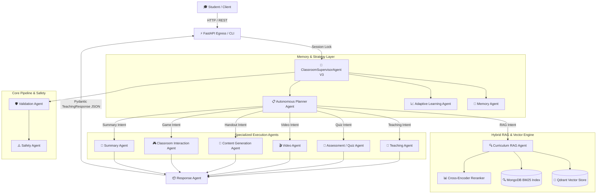

# Silicon Project - AI Classroom Teaching Robot (V1, V2 & V3)

Silicon Project is a high-performance multi-agent educational platform and Curriculum RAG (Retrieval-Augmented Generation) system built for physical and virtual classroom teaching robots. The system is designed to provide age-appropriate, grounded, and engaging educational experiences for students (Grades 1 to 10).

---

## 🌟 Version Progression & Milestone Overview

### 🔹 Version 1: Direct LLM Explanation Core
- **Multi-Agent Pipeline**: `ClassroomSupervisorAgent` orchestrating hand-offs between `ValidationAgent`, `SafetyAgent`, `TeachingAgent`, and `ResponseAgent`.
- **Model Gateway**: Centralized `LLMGateway` with exponential backoff retries and dynamic failover from primary model (`llama-3.3-70b-versatile`) to fallback (`llama-3.1-8b-instant`).
- **Session Concurrency & State**: Redis + MongoDB dual-engine `SessionStateManager` with thread-safe 15-second session locks and in-memory fallbacks.
- **Egress Contract**: Guaranteed output structure matching `TeachingResponse` schema.

### 🔹 Version 2: Curriculum-Grounded RAG & Interactive Features
- **Hybrid Curriculum RAG**: Dense vector search (Qdrant / `all-MiniLM-L6-v2`) combined with sparse keyword search (MongoDB BM25 text index) and cross-encoder reranking (`ms-marco-MiniLM-L-6-v2`).
- **Citation Generation**: Page-level, chapter, and document citations verifying answer claims against ingested NCERT textbooks.
- **Interactive Flag Quiz Cards**: Dynamic 4-option flashcard generation with deduplication and terminal-based practice execution.
- **Educational Video Blueprints**: Scene-by-scene script breakdowns with narration transcripts and structured visual prompts for video AI generators.
- **User Authentication**: Student/Teacher role management with grade level binding (Classes 1–10).

### 🔹 Version 3: Autonomous Adaptive Learning & Storage Architecture
- **Supervisor V3 & Specialized Agent Ecosystem**:
  - **`AdaptiveLearningAgent`**: Analyzes student history to choose difficulty level, teaching style, and learning path.
  - **`PlannerAgent`**: Formulates autonomous execution strategies based on student query intent.
  - **`MemoryAgent`**: Manages working, session, long-term, and curriculum memory stores.
  - **`AssessmentAgent`**: Generates structured MCQs and diagnostic tests.
  - **`ContentGenerationAgent`**: Formats printable handouts, worksheets, and Markdown summaries.
  - **`SummaryAgent`**: Formulates lesson wrap-ups, formula sheets, and homework assignments.
  - **`AnalyticsAgent`**: Tracks learning progress, mastery metrics, and engagement scores.
  - **`ClassroomInteractionAgent`**: Executes gamified activities, rapid-fire sessions, and leaderboard scoring.
- **Layout-Aware PDF Storage Service (`storage_service`)**:
  - Catalog-driven batch ingestion of NCERT textbooks (`newestbooks.json`).
  - Preserves visual reading order, Markdown tables (`| ... |`), section headings (`#`), and page images.
  - Single-collection MongoDB aggregate root model (`BOOKS`) with embedded chapters and page objects.

---

## 🛠️ Technology Stack

| Layer | Technology | Description |
| :--- | :--- | :--- |
| **Agent Orchestration** | AgentScope v1.x | Async multi-agent framework |
| **LLM Gateway** | Groq API | Primary: `llama-3.3-70b-versatile` \| Fallback: `llama-3.1-8b-instant` |
| **Database** | MongoDB Atlas / Local | `Ncert_Rag` database, Motor async driver |
| **Vector Engine** | Qdrant | Vector similarity search engine |
| **Session & Cache** | Redis | Session state, locking, and query caching |
| **Embeddings & Reranking** | PyTorch / Transformers | `sentence-transformers/all-MiniLM-L6-v2` & `cross-encoder/ms-marco-MiniLM-L-6-v2` |
| **Backend & APIs** | FastAPI & Pydantic V2 | Async REST API endpoints |
| **Deployment** | Docker & Docker Compose | Containerized backend, Mongo, Redis, and Qdrant |
| **Frontend** | React | Web-based student/teacher dashboard |

---

## 🤖 System Architecture



---

## 📂 Repository Structure

```text
Silicon_Project/
├── agents/
│   ├── supervisor_agent_v3.py        # Version 3 autonomous multi-agent supervisor
│   ├── supervisorAgentV2.py          # Version 2 RAG & intent supervisor
│   ├── supervisorAgent.py            # Version 1 direct LLM supervisor
│   ├── adaptive_learning_agent.py    # Learning profile & difficulty adaptation
│   ├── planner_agent.py              # Autonomous strategy & execution planner
│   ├── memory_agent.py               # Memory state manager
│   ├── assessment_agent.py           # Quiz & MCQ test generator
│   ├── content_generation_agent.py   # Handout & worksheet generator
│   ├── summary_agent.py              # Lesson revision & summary generator
│   ├── analytics_agent.py            # Mastery & analytics engine
│   ├── classroom_interaction_agent.py# Gamified rapid-fire interaction agent
│   ├── quizAgent.py                  # Flag Quiz card generator
│   ├── videoAgent.py                 # Video blueprint generator
│   ├── teachingAgent.py              # Kid-friendly concept explanation agent
│   ├── safetyAgent.py                # Safety & age-appropriateness filter
│   ├── validatorAgent.py             # Input sanitization & injection protection
│   └── responseAgent.py              # Schema-compliant JSON response formatter
├── ai_teacher_robot/
│   ├── agents/retrieval/             # Curriculum RAG, Planner, and Rewriter agents
│   ├── rag/                          # Hybrid search, vector store, and BM25 index
│   └── repositories/                 # Async Mongo repositories (v3 included)
├── api/
│   ├── main.py                       # FastAPI application entrypoint
│   └── routes_query.py               # REST API endpoints (/query, /login, /ingest)
├── storage_service/
│   ├── services/pymupdf/             # PyMuPDF text & image extraction
│   ├── services/mongo/               # MongoDB Book, Object, and Ingestion services
│   ├── pipeline/                     # Ingestion pipeline & page processing
│   ├── ingest.py                     # Single PDF ingestion CLI
│   └── ingest_catalog.py             # Catalog-driven NCERT batch ingestion CLI
├── models/
│   ├── compat.py                     # AgentScope compatibility monkeypatches
│   ├── llm_gateway.py                # Model-agnostic gateway (failover & retries)
│   └── schemas.py                    # Pydantic system schemas
├── prompts/                          # Class 1–10 subject-specific prompts
├── main.py                           # Interactive CLI entry point
├── docker-compose.yml                # Docker services setup (Mongo, Redis, Qdrant)
├── Dockerfile                        # FastAPI backend image build
├── conftest.py                       # Root Pytest path setup
├── requirements.txt                  # Python dependencies
└── README.md                         # Project documentation
```

---

## ⚙️ Setup & Installation Guide

### 1. Prerequisites
- **Python**: `3.10` - `3.13`
- **Docker Desktop** (for containerized DB services)

### 2. Clone & Environment Setup
```bash
# Clone the repository
git clone https://github.com/RonakRaj-dev/Humanoid-AI.git
cd Silicon_Project

# Create and activate Python virtual environment
python -m venv .venv

# On Windows:
.venv\Scripts\activate
# On Linux/macOS:
source .venv/bin/activate

# Install required dependencies
pip install -r requirements.txt
```

### 3. Environment Variables Configuration
Create a `.env` file in the project root:

```ini
# Core LLM API Key (Groq)
GROQ_API_KEY="gsk_your_groq_api_key_here"
GROQ_MODEL_NAME="llama-3.3-70b-versatile"
GROQ_FALLBACK_MODEL="llama-3.1-8b-instant"
GROQ_BASE_URL="https://api.groq.com/openai/v1"

# Database Configuration
MONGO_URI="mongodb://127.0.0.1:27017"
MONGO_DB_NAME="Ncert_Rag"

# Redis Session & Cache Configuration
REDIS_HOST="127.0.0.1"
REDIS_PORT=6379

# Vector Store Engine
VECTOR_STORE_TYPE="qdrant"
QDRANT_HOST="127.0.0.1"
QDRANT_PORT=6333
```

---

## 🐳 Running with Docker

Start the containerized infrastructure (MongoDB, Redis, Qdrant vector engine, and FastAPI backend):

```bash
docker-compose up -d
```

To view logs or verify running containers:
```bash
docker-compose ps
docker-compose logs -f backend
```

---

## 📚 Data Ingestion Pipeline

### Option A: Ingest a Single PDF Textbook
```bash
python storage_service/ingest.py path/to/book.pdf --title "Science Class 10" --class 10 --subject Science
```

### Option B: Catalog-Driven Batch Ingestion (Classes 1–10)
```bash
python storage_service/ingest_catalog.py --catalog newestbooks.json --pdf-dir ./data/pdfs
```

---

## 🚀 Running the Application

### 1. Interactive Terminal CLI
```bash
python main.py
```

### 2. FastAPI REST Server
Start the backend web server locally:
```bash
uvicorn api.main:app --reload --port 8000
```
Interactive API documentation is accessible at `http://localhost:8000/docs`.

---

## 🧪 Testing & Verification

Run the full automated test suite (includes V1, V2, V3, and `storage_service` unit tests):

```bash
pytest -v
```

All 167+ unit and integration tests are verified and passing.
