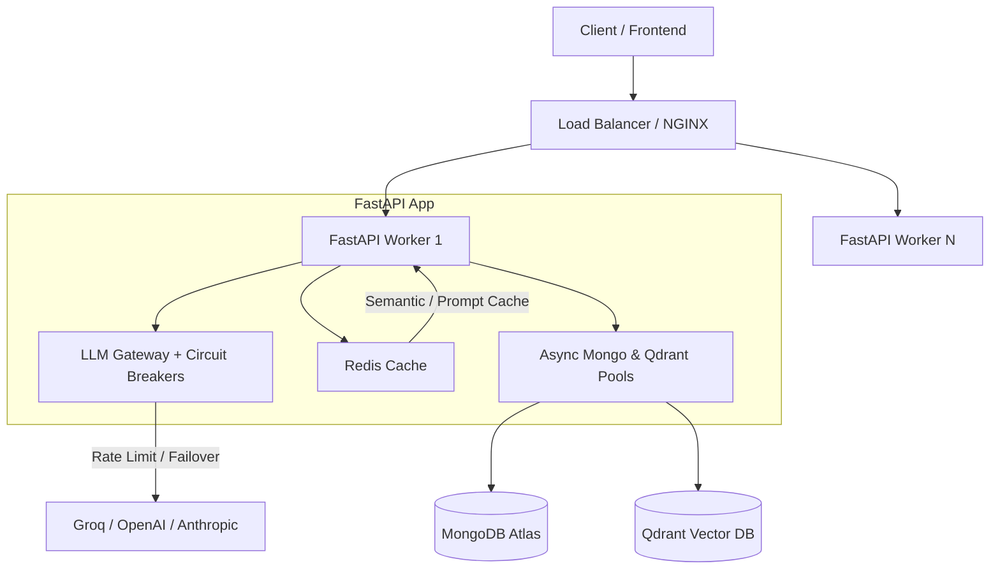

Here is an honest, production-hardened assessment of what it takes to transition a complex AI multi-agent architecture (like your FastAPI + AgentScope + RAG + MongoDB system) from a dev/prototype stage into a **resilient, high-concurrency, zero-downtime production backend**.

---

### 1. Architectural Bottlenecks in the Current Setup

#### A. Agent & Dependency Instantiation Overhead

- **The Issue:** `ClassroomSupervisorAgentV3` instantiates 16+ sub-agents, repository objects, MongoDB managers, and RAG pipelines inside its constructor (`__init__`).
- **Production Impact:** Re-instantiating agents or loading ML models (`SentenceTransformer`, `CrossEncoder`) per request/session destroys throughput and inflates memory usage.
- **Production Fix:**
  - **Singletons & Lifespan Injection:** Use FastAPI’s `@asynccontextmanager` (`lifespan`) to load heavy dependencies (embedding models, vector store clients, Redis pools, shared agent pools) **once** at server startup.
  - Inject these pre-initialized singletons or lightweight references into request handlers.

#### B. Event Loop Blocking (CPU-Bound ML vs. Async I/O)

- **The Issue:** Embedding generation (`SentenceTransformer.encode()`) and reranking (`CrossEncoder.predict()`) are heavy CPU/GPU operations. Running them directly inside `async def` functions blocks FastAPI's single-threaded event loop.
- **Production Impact:** While one user's query is being embedded or reranked, **all other concurrent API requests stall**.
- **Production Fix:**
  - Wrap CPU/ML tasks in `asyncio.to_thread()` or `loop.run_in_executor()` to run them on worker threadpools:
    ```python
    embeddings = await asyncio.to_thread(embedding_model.encode, text)
    ```
  - For high throughput, move heavy ML/embedding tasks to dedicated background workers (Celery, ARQ, or a separate microservice using Triton / vLLM / TEI).

---

### 2. Scalability & Resilience Blueprint



---

### 3. Core Pillars for Production Engineering

#### 1. Resilient LLM Gateway (Circuit Breakers & Token Buckets)

External LLM APIs (Groq, OpenAI) **will** fail, rate-limit (HTTP 429), or experience high latency spikes.

- **Circuit Breakers (`pybreaker` or custom):** If Groq returns 5xx errors for >15% of requests over 1 minute, trip the breaker immediately to fallback models (e.g., local vLLM or secondary provider) without waiting 30 seconds for timeouts per request.
- **Token Bucket Rate Limiting:** Enforce client-side rate limits before calling external APIs to avoid hitting provider quotas.
- **Streaming Responses (First-Token Latency):** Use Server-Sent Events (SSE) or WebSockets so users see response tokens immediately (~300–500ms first token latency) instead of waiting 15 seconds for a multi-agent pipeline to finish generating 2000 tokens.

#### 2. Multi-Tier Caching

- **Semantic Caching:** Store past `(query, embedding, response)` pairs in Redis. If a student asks a question with >0.95 cosine similarity to a recently answered question, serve the cached answer immediately. This cuts LLM costs and drops latency from 3s to 20ms.
- **Session State Cache:** Store active conversation context in Redis with an TTL (e.g., 24h) instead of querying MongoDB on every turn. Sync to MongoDB asynchronously.

#### 3. Production Database Optimization

- **MongoDB Connection Pool:** Configure explicit pool limits:
  ```python
  client = AsyncIOMotorClient(mongo_uri, minPoolSize=10, maxPoolSize=100, maxIdleTimeMS=45000)
  ```
- **Qdrant Vector Store:** Enable gRPC mode (`prefer_grpc=True`) for lower RPC serialization overhead, and index payload fields (e.g., `subject_id`, `topic_id`).

#### 4. Observability & Telemetry (The 4 Golden Signals)

You cannot fix what you cannot measure:

- **Metrics (Prometheus + Grafana):**
  - **Latency:** p50, p95, p99 request duration.
  - **Traffic:** Requests Per Second (RPS).
  - **Errors:** Error rate by status code and agent name.
  - **Saturation:** CPU, Memory, Event Loop Lag, Mongo Connection Pool usage.
- **Distributed Tracing (OpenTelemetry + Jaeger / Arize Phoenix):** Trace the exact execution path of a request: `HTTP Request -> SupervisorV3 -> SafetyAgent -> RAG Pipeline (Embedding + Qdrant) -> LLM Gateway -> Output`.
- **Structured JSON Logging:** Use structured loggers (e.g., `structlog` or `loguru` configured with JSON formatting) attaching a `trace_id` to every log line.

#### 5. Graceful Degradation

Always define fallback behavior:

- If Qdrant is unreachable $\rightarrow$ Fallback to MongoDB text search.
- If primary LLM model fails $\rightarrow$ Fallback to lighter model.
- If Safety Agent times out $\rightarrow$ Default to safe fallback response rather than hanging or returning raw unvetted output.

---

### Recommended Next Steps for Implementation

1. **Refactor Singletons:** Move `EmbeddingGenerator`, `DatabaseClient`, and `QdrantStore` initialization to FastAPI startup lifespan.
2. **Event Loop Audit:** Wrap all synchronous CPU calls (`SentenceTransformer`, `CrossEncoder`, file operations) in `asyncio.to_thread`.
3. **Add Redis Caching & Rate Limiting:** Introduce Redis for session state and rate limiting via `slowapi` or Redis middleware.
4. **Setup Health Check Endpoints:** Implement `/healthz` (liveness) and `/readyz` (readiness checking MongoDB & Qdrant connectivity).
