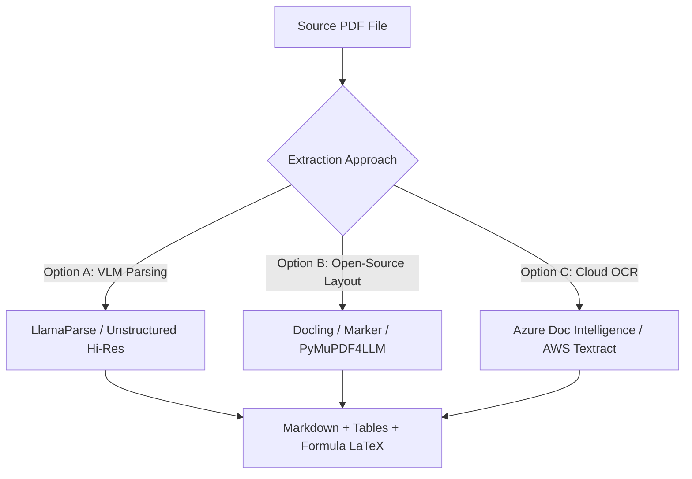
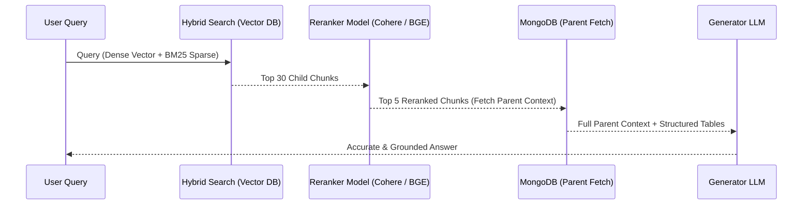

# Architecture Blueprint: Advanced PDF Extraction, Structuring & Storage for LLM Access

## Executive Summary

Extracting text using standard PDF parsers (like plain `page.get_text()`) leads to severe data degradation: loss of reading order in multi-column layouts, garbled tables, lost formulas, and missing figures. Storing raw text blobs directly into MongoDB makes LLM retrieval (RAG) context-blind and inaccurate.

Since budget is not a constraint at this stage, the goal is **maximum extraction quality, rich structural retention, and hybrid multi-tier retrieval**.

---

## 1. Core Problem with Current Approach

```
[Raw PDF] ➔ PyMuPDF get_text() ➔ Garbled Text Blob ➔ MongoDB ➔ Poor LLM Retrieval
  - Multi-column reading order scrambled
  - Tables converted to unparseable line breaks
  - Formulas/LaTeX converted to missing glyphs
  - No visual figures or chart context preserved
```

---

## 2. Recommended Extraction & Parsing Approaches

To provide LLMs with clean, structural context, replace plain text extraction with **layout-aware parsing** or **Vision-Language Model (VLM) parsing**.



### Option 1: Vision-Language / Multimodal Parsers (Top Recommendation)
* **LlamaParse (by LlamaIndex)**: Uses multimodal LLMs under the hood to parse complex PDFs. Converts tables into clean Markdown tables, formulas into LaTeX, and retains section hierarchies.
* **Unstructured.io (Hi-Res Mode)**: Uses LayoutLMv3 models to split documents into distinct element types (`Title`, `NarrativeText`, `Table`, `Image`, `Header`).
* **Mistral OCR / GPT-4o Vision Processing**: Renders PDF pages to images and processes them directly via visual LLMs to output structured Markdown.

### Option 2: Open-Source Layout-Aware Libraries
* **Docling (by IBM / DS4SD)**: State-of-the-art open-source PDF parsing engine that retains layout, converts tables into structured models, and outputs Markdown/JSON.
* **Marker / PyMuPDF4LLM**: Wraps PyMuPDF with layout analysis heuristics to generate clean Markdown formatted specifically for LLM embedding.

### Option 3: Enterprise Document APIs
* **Azure AI Document Intelligence (Layout Model)**: Generates reading-order aware text, bounding boxes, and native Markdown tables.
* **AWS Textract (Tables & Layout)**: Ideal for complex form and tabular data extraction.

---

## 3. Storage Architecture: Multi-Tier Strategy

Rather than relying solely on MongoDB or a basic Vector Store, deploy a **Hybrid Multi-Tier Architecture**.

```
                           ┌───────────────────────────────┐
                           │      Raw PDF Files & Images   │
                           │   (AWS S3 / MinIO Storage)    │
                           └───────────────┬───────────────┘
                                           │
                           ┌───────────────▼───────────────┐
                           │      Layout-Aware Parser      │
                           └───────────────┬───────────────┘
                                           │
             ┌─────────────────────────────┼─────────────────────────────┐
             │                             │                             │
┌────────────▼────────────┐  ┌─────────────▼────────────┐  ┌──────────────▼────────────┐
│   MongoDB / Postgres    │  │     Vector Database      │  │     Graph Database       │
│  (Document & Metadata)  │  │   (Qdrant / Milvus)      │  │    (Neo4j - GraphRAG)     │
├─────────────────────────┤  ├──────────────────────────┤  ├────────────────────────┤
│ - AST Document Tree     │  │ - Child Chunk Embeddings │  │ - Entity Relationships │
│ - Page & Section Map    │  │ - Dense + Sparse vectors │  │ - Concept Dependencies │
│ - Markdown Tables       │  │ - Hybrid BM25 Index      │  │ - Cross-Chapter Links  │
│ - Raw Text & Provenance │  │ - Metadata Filters       │  │                        │
└─────────────────────────┘  └──────────────────────────┘  └────────────────────────┘
```

### Tier Breakdown

| Storage Tier | Recommended Tech | Primary Purpose & Schema |
| :--- | :--- | :--- |
| **Tier 1: Object Storage** | AWS S3, MinIO, Azure Blob | Stores raw PDF originals, rendered page images (PNG), and extracted image figures/charts. |
| **Tier 2: Document DB** | MongoDB / PostgreSQL (JSONB) | Stores document metadata, hierarchical tree (Book → Chapter → Section → Page), Markdown sections, table structures, and source page provenance. |
| **Tier 3: Vector DB** | Qdrant, Milvus, Pinecone, or `pgvector` | Stores dense semantic embeddings (OpenAI `text-embedding-3-large` or Cohere Embed v3) + BM25 sparse vectors for hybrid keyword-semantic search. |
| **Tier 4: Knowledge Graph (Optional)** | Neo4j, Memgraph | Stores domain entities and concepts (GraphRAG) to allow the LLM to perform multi-hop reasoning across chapters. |

---

## 4. Data Structuring & Chunking Strategy for LLMs

### A. Markdown-Native Section Chunking
Instead of splitting text by arbitrary character counts (e.g. 500 characters), split by **structural Markdown headers** (`#`, `##`, `###`).
* Keeps related explanations, code snippets, and definitions together in one chunk.

### B. Parent-Child (Hierarchical) Retrieval
* **Child Chunks (150 – 300 tokens)**: Small, tightly focused passages stored in the Vector DB for high precision similarity matches.
* **Parent Documents (Section / Full Page ~1000 tokens)**: Stored in MongoDB. When a child chunk is matched, the system retrieves its parent context to pass to the LLM.

### C. Contextual Chunk Prepending (Anthropic Pattern)
Prepend a brief global context header to every chunk before generating embeddings:
```markdown
Document: Class 11 Physics Chapter 3.pdf | Section: Newton's Third Law
------------------------------------------------------------------------
[Actual chunk text...]
```
This ensures isolated vectors carry global document context.

### D. Table & Visual Figure Handling
* **Tables**: Store as clean Markdown tables (`| Col 1 | Col 2 |`) or HTML `<table>`. LLMs natively understand Markdown tables far better than plain text lists.
* **Images & Diagrams**: Pass extracted visual figures through a VLM (e.g. GPT-4o) to generate a detailed text summary. Index both the image summary and the original image path.

---

## 5. RAG Retrieval & Reranking Pipeline



1. **Hybrid Search**: Combine Dense Vector Search (semantic context) with Sparse Keyword Search (BM25 for exact terms, proper nouns, formulas).
2. **Reranking**: Pass top 30-50 search results through a Reranker model (**Cohere Rerank v3** or **BGE-Rerank-v2**) to rank the top 5 most relevant passages.
3. **Parent Context Assembly**: Retrieve the full surrounding section/page from MongoDB for the top reranked chunks.

---

## 6. Actionable Implementation Roadmap

1. **Replace PDF Extraction Engine**: Migrate from standard `PyMuPDF.get_text()` to **Docling**, **LlamaParse**, or **PyMuPDF4LLM** to output clean Markdown.
2. **Setup Hybrid Vector Store**: Integrate **Qdrant** or **Milvus** alongside MongoDB.
3. **Implement Hierarchical Chunking**: Store small child chunks in Qdrant with `parent_id` referencing MongoDB parent section documents.
4. **Add Reranking**: Incorporate Cohere Rerank or BGE Reranker into your retrieval service.
