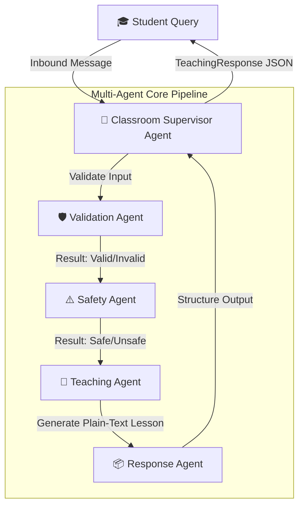

# Project Report: Classroom Teaching Robot (Silicon Project V1)

This report outlines the technical details, system architecture, core implementation accomplishments, design rationales, and testing status of **Silicon Project (Version 1)**. It is structured for presentation to your project mentor.

---

## 1. Executive Summary & Project Goal

The **Silicon Project** is a high-performance multi-agent educational pipeline designed to orchestrate and parse student queries for a classroom teaching robot. 
*   **Target Audience**: Elementary school students (Grades 1 to 5, ages 6–11).
*   **Version 1 Objective**: Deliver highly responsive, age-appropriate, and structured concept explanations by utilizing direct LLM inference (via the Groq API), omitting complex text extraction (RAG/PDF ingestion) to optimize latency, scalability, and execution stability.

---

## 2. System Architecture

The core of the system is a sequential, multi-agent pipeline orchestrated using the **AgentScope** framework. The pipeline processes student queries through successive layers of validation, safety check, explanation generation, and schema-compliant formatting.



---

## 3. Core Components & Agent Responsibilities

The system consists of five specialized agents, each operating with specific boundaries and system instructions:

| Agent | Module File | Core Responsibility | Input | Output / Egress Schema |
| :--- | :--- | :--- | :--- | :--- |
| **Classroom Supervisor** | [supervisorAgent.py](file:///c:/Users/gamer/OneDrive/Desktop/Silicon_Project/agents/supervisorAgent.py) | Coordinates pipeline routing, manages thread-safe session execution, applies concurrency locks, and records message history. | Inbound student query | `AgentResult` envelope containing final structured data or error trace. |
| **Validator** | [validatorAgent.py](file:///c:/Users/gamer/OneDrive/Desktop/Silicon_Project/agents/validatorAgent.py) | Sanitizes text, guards against prompt injections, detects token overflows, and identifies empty or garbage inputs. | Raw student query | JSON: `{"valid": bool, "reason": str}` |
| **Safety** | [safetyAgent.py](file:///c:/Users/gamer/OneDrive/Desktop/Silicon_Project/agents/safetyAgent.py) | Evaluates query safety, age-appropriateness, and educational relevance for children. | Clean student query | JSON: `{"safe": bool, "reason": str}` |
| **Teaching** | [teachingAgent.py](file:///c:/Users/gamer/OneDrive/Desktop/Silicon_Project/agents/teachingAgent.py) | Explains concepts using kid-friendly language, engaging analogies, and active learning elements (e.g., home experiments). | Verified child-safe query | Kid-friendly plain-text explanation |
| **Response (Formatter)** | [responseAgent.py](file:///c:/Users/gamer/OneDrive/Desktop/Silicon_Project/agents/responseAgent.py) | Structures plain-text lessons into a rigid, structured JSON payload matching the target Pydantic schema. | Plain-text explanation | Structured JSON matching `TeachingResponse` schema |

---

## 4. Technical Design Decisions: The "Why"

Every major architectural choice in Version 1 was driven by reliability, performance under rate limits, and deployment flexibility:

### 4.1. The LLM Gateway (Failover & Retry Architecture)
*   **Why**: External APIs (like Groq) are susceptible to rate limits (TPM/RPM limits) and random network failures.
*   **Solution**: Built a centralized [llm_gateway.py](file:///c:/Users/gamer/OneDrive/Desktop/Silicon_Project/models/llm_gateway.py) implementing:
    *   **Primary model routing** using `llama-3.3-70b-versatile`.
    *   **Exponential backoff and retry policy** (3 attempts by default) for transient errors.
    *   **Failover mechanism** that switches dynamically to `groq_fallback` (`llama-3.1-8b-instant`) if the primary model persistently fails, protecting system uptime.

### 4.2. Dual-Engine State Manager with In-Memory Fallbacks
*   **Why**: The robot requires short-term conversation context and long-term execution logs. However, local or offline test runs shouldn't crash if external databases are down.
*   **Solution**: Implemented a thread-safe [sessionState.py](file:///c:/Users/gamer/OneDrive/Desktop/Silicon_Project/state/sessionState.py) manager that uses:
    *   **Redis** for quick context retrieval.
    *   **MongoDB** for long-term audit trail storage.
    *   **Automatic In-Memory Fallbacks**: If Redis or MongoDB connections timeout or fail, the system seamlessly redirects calls to standard in-memory dictionaries and threading timers. No code changes are needed when deploying from cloud settings to standalone offline devices.

### 4.3. Session Concurrency Control (Session Locking)
*   **Why**: Prevent race conditions. If a user presses "submit" multiple times, processing overlapping LLM requests concurrently on the same session causes history corruption.
*   **Solution**: Embedded a 15-second locking mechanism in [sessionState.py](file:///c:/Users/gamer/OneDrive/Desktop/Silicon_Project/state/sessionState.py) and enforced in the supervisor. Concurrent queries are rejected immediately with a `Concurrent message error`.

### 4.4. Structured Egress Contract (`TeachingResponse`)
*   **Why**: Downstream robotic hardware (screens, text-to-speech, animations) cannot easily parse unpredictable raw LLM text.
*   **Solution**: Modeled in [schemas.py](file:///c:/Users/gamer/OneDrive/Desktop/Silicon_Project/models/schemas.py), the output is guaranteed to follow the `TeachingResponse` schema:
    ```json
    {
      "answer": "Primary explanation text...",
      "summary": "Concise single-sentence summary.",
      "key_points": ["Key takeaway 1", "Key takeaway 2"],
      "teaching_mode": "Concept Mode / Story Mode / Q&A Mode",
      "diagram_required": true/false,
      "video_required": true/false,
      "quiz_generated": true/false,
      "confidence_score": 0.95
    }
    ```

---

## 5. Development Progress & Resolved Issues

Several key engineering bugs were resolved during development to ensure the project operates smoothly:

1.  **Resolved Pytest DNS/Timeout Hang**:
    *   *Problem*: Pytest hung for several minutes on `test_session_state_in_memory_fallback` because it attempted to contact `invalid_host` synchronously, triggering slow OS-level DNS queries.
    *   *Solution*: Changed test configurations to point to `127.0.0.1` and ensured database layers are mocked properly during component tests. Tests now complete under 3 seconds.
2.  **Standardized File Naming Conventions**:
    *   *Problem*: Typo in filename `vaidatorAgent.py` causing import mismatching.
    *   *Solution*: Renamed to [validatorAgent.py](file:///c:/Users/gamer/OneDrive/Desktop/Silicon_Project/agents/validatorAgent.py) and refactored imports across the workspace.
3.  **Enhanced Model Parameter Compatibility**:
    *   *Problem*: AgentScope wrapper configurations had strict signature requirements, complicating standard parameter mappings.
    *   *Solution*: Designed monkey-patches in [compat.py](file:///c:/Users/gamer/OneDrive/Desktop/Silicon_Project/models/compat.py) to map parameters cleanly behind the scenes.

---

## 6. Current Testing & Verification Status

The project includes a robust unit and integration testing suite configured in `tests/test_components.py`.

### 6.1. Automated Test Results
Running the command `.venv\Scripts\pytest -v` compiles the following results:

```text
tests/test_components.py::test_session_state_in_memory_fallback PASSED
tests/test_components.py::test_agent_state_manager PASSED
tests/test_components.py::test_gateway_retry_and_success[asyncio] PASSED
tests/test_components.py::test_gateway_failover_to_fallback[asyncio] PASSED
tests/test_components.py::test_supervisor_pipeline_success[asyncio] PASSED
tests/test_components.py::test_supervisor_pipeline_validation_fail[asyncio] PASSED

======================== 6 passed in 2.86s =========================
```

### 6.2. Interactive Pipeline Verification
The pipeline can be executed dynamically using [run_pipeline.py](file:///c:/Users/gamer/OneDrive/Desktop/Silicon_Project/run_pipeline.py):

*   **Execution Command**:
    ```bash
    python run_pipeline.py "Why is the sky blue?"
    ```
*   **Sample Output**:
    ```json
    ==================================================
     PIPELINE EXECUTION RESULTS
    ==================================================
    Total Execution Time: 2.145 seconds
    Success Status: True

    Structured Response (TeachingResponse Schema):
    {
      "answer": "Have you ever looked up at the sky and wondered why it's so beautifully blue? Well, it's all thanks to sunlight! Sunlight looks white, but it's actually made of all the colors of the rainbow mixed together. When this light reaches Earth's atmosphere, it hits all the tiny particles in the air. The blue light waves are short and small, so they scatter in every direction, coloring the sky! It's just like scattering glitter in the wind.",
      "summary": "The sky is blue because sunlight scatters when it hits the Earth's atmosphere, scatter-painting it blue.",
      "key_points": [
        "sunlight",
        "atmosphere",
        "scattering",
        "colors of the rainbow"
      ],
      "teaching_mode": "Concept Mode",
      "diagram_required": true,
      "video_required": false,
      "quiz_generated": false,
      "confidence_score": 0.98
    }
    ==================================================
    ```
